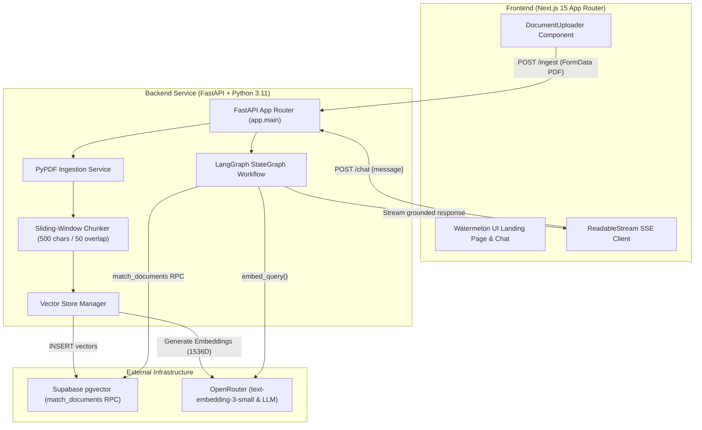

# Docent — Production-Grade Document Intelligence & RAG Engine

[](https://nextjs.org/)
[](https://fastapi.tiangolo.com/)
[](https://python.langchain.com/)
[](https://supabase.com/)
[](LICENSE)

**Docent** is a high-performance, enterprise Retrieval-Augmented Generation (RAG) platform designed for real-time document search, automatic PDF chunking, vector embedding storage in Supabase `pgvector`, and Server-Sent Events (SSE) token streaming.

---

## 🏛️ System Architecture



---

## 🚀 Key Features

1. **Sliding-Window PDF Chunker**: Splits extracted PDF text into 500-character chunks with a 50-character sentence boundary overlap to eliminate context fragmentation.
2. **1536-Dimensional Vector Search**: Embeds chunks using OpenRouter `text-embedding-3-small` and indexes vectors in Supabase PostgreSQL via the HNSW cosine similarity RPC `match_documents`.
3. **LangGraph State Graph Workflow**: Orchestrates retrieval, similarity matching, fallback LLM routing, and structured citation context using stateful graph nodes.
4. **Real-time SSE Token Streaming**: Streams generated LLM tokens to the client over Server-Sent Events (`text/event-stream`) for sub-second first-token latency.
5. **Expandable Source Citations**: Shows precise document quotes, source page numbers, and cosine similarity scores (`77.7% match`) for full AI groundability.
6. **Watermelon UI & Framer Motion**: Full-bleed dark mode interface featuring Framer Motion staggered entrance animations, mouse spotlight tracking, and interactive architecture tabs.

---

## 🛠️ Tech Stack

| Domain | Technology | Purpose |
| :--- | :--- | :--- |
| **Frontend** | Next.js 15 (App Router), TypeScript, TailwindCSS | High-performance SPA with server-rendering and SSE reader |
| **Animations** | Framer Motion, Lucide Icons, React Icons | Smooth staggered reveals, spring physics, and watermarks |
| **Backend API** | FastAPI 0.115, PyPDF, Pydantic v2 | Async web server, PDF parsing, schema validation |
| **RAG Graph** | LangGraph (`StateGraph`), LangChain | Orchestrates multi-step retrieval & stream generation |
| **Vector DB** | Supabase PostgreSQL (`pgvector`) | Vector embedding storage & HNSW cosine RPC matching |
| **AI Models** | OpenRouter (`text-embedding-3-small` + LLM) | 1536D embedding generation and grounded answer synthesis |

---

## 📦 Project Structure

```
pdf-chat-rag/
├── backend/
│   ├── app/
│   │   ├── services/
│   │   │   ├── pdf_service.py     # PDF loading & text sanitization
│   │   │   ├── chunker.py         # Recursive sliding window chunker
│   │   │   └── vector_store.py    # Supabase pgvector embedding & RPC matching
│   │   ├── graphs/
│   │   │   ├── ingest_graph.py    # Ingestion LangGraph workflow
│   │   │   └── retrieval_graph.py # Retrieval & SSE stream LangGraph
│   │   ├── config.py              # Pydantic environment configuration
│   │   └── main.py                # FastAPI endpoints (/ingest, /chat)
│   ├── tests/                     # Pytest suite
│   ├── requirements.txt           # Python dependencies
│   └── .env.example
├── frontend/
│   ├── src/
│   │   ├── app/
│   │   │   ├── page.tsx           # Home landing page with Hero4 & RAG Simulator
│   │   │   ├── upload/page.tsx    # PDF Ingestion page with DocumentUploader
│   │   │   └── chat/page.tsx      # Real-time SSE Chat interface
│   │   └── components/
│   │       ├── Hero4.tsx          # Animated Watermelon UI hero
│   │       ├── FeatureSection.tsx # Interactive RAG architecture simulator
│   │       ├── DocumentUploader.tsx # Drag-and-drop ingestion component
│   │       └── Footer.tsx         # Watermark footer
│   ├── .env.local                 # Local environment variables
│   └── package.json
└── README.md
```

---

## ⚡ Quick Start (Local Development)

### Prerequisites
- Python 3.11+
- Node.js 18+
- Supabase project with `pgvector` enabled

### 1. Backend Setup
```bash
cd backend

# Create and activate virtual environment
python -m venv .venv
# On Windows:
.venv\Scripts\activate
# On macOS/Linux:
source .venv/bin/activate

# Install Python dependencies
pip install -r requirements.txt

# Create .env from example
cp .env.example .env
```

Configure `backend/.env`:
```env
OPENROUTER_API_KEY=your_openrouter_api_key
SUPABASE_URL=https://your-supabase-project.supabase.co
SUPABASE_KEY=your_supabase_service_role_key
```

Run backend server:
```bash
python -m app.main
```
The FastAPI backend will start at `http://localhost:8000`.

### 2. Frontend Setup
```bash
cd frontend

# Install Node dependencies
npm install

# Create .env.local
echo "NEXT_PUBLIC_API_URL=http://localhost:8000" > .env.local

# Run Next.js dev server
npm run dev
```
The frontend will start at `http://localhost:3000`.

---

## 🔌 API Endpoints Documentation

### 1. Ingest PDF Document
- **Endpoint**: `POST /ingest`
- **Content-Type**: `multipart/form-data`
- **Payload**: `file: [PDF Document]`
- **Response**:
```json
{
  "filename": "sample_contract.pdf",
  "chunks_count": 14,
  "inserted_records_count": 14,
  "status": "success"
}
```

### 2. Chat & Vector Search (SSE Stream)
- **Endpoint**: `POST /chat`
- **Content-Type**: `application/json`
- **Payload**:
```json
{
  "message": "What are the termination conditions in the contract?"
}
```
- **Response Stream (`text/event-stream`)**:
```
data: {"token": "Based "}
data: {"token": "on "}
data: {"token": "the "}
data: {"token": "document, "}
...
data: {"event": "done", "sources": [{"content": "...", "metadata": {"source_filename": "sample_contract.pdf"}, "similarity": 0.84}]}
```

---

## 🎓 Technical Interview Deep Dives

### Q1: Why use Server-Sent Events (SSE) over WebSockets for RAG Streaming?
> **Answer**: SSE is a unidirectional HTTP streaming protocol (`text/event-stream`) ideally suited for LLM completion tokens where data flows purely from server to client. Unlike WebSockets, SSE operates over standard HTTP/2, requires no custom handshake or stateful socket server management, automatically reconnects on network dropouts, and bypasses proxy/firewall blocking.

### Q2: How does the sliding-window chunking algorithm prevent hallucination?
> **Answer**: Naive character chunking often breaks sentences mid-thought, destroying semantic meaning. Our `RecursiveCharacterTextSplitter` uses a 500-character window with a 50-character overlap using natural break hierarchy (`["\n\n", "\n", ". ", " "]`). The 50-character overlap ensures adjacent chunks share boundary context, enabling the vector similarity search to match search queries spanning chunk boundaries.

### Q3: Explain the Supabase `pgvector` Cosine Distance function.
> **Answer**: In PostgreSQL `pgvector`, vectors are stored in 1,536-dimensional float arrays. The `<=>` operator computes cosine distance (`distance = 1 - similarity`). Our RPC function `match_documents` filters embeddings with:
> `1 - (documents.embedding <=> query_embedding) AS similarity`
> ordering by `embedding <=> query_embedding LIMIT match_count`.

---

## 📄 License
Distributed under the MIT License. See `LICENSE` for more information.
